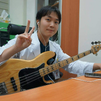
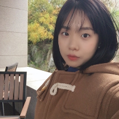
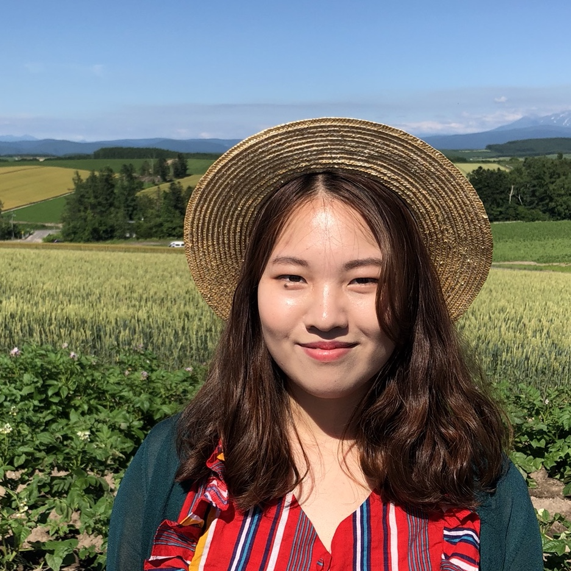
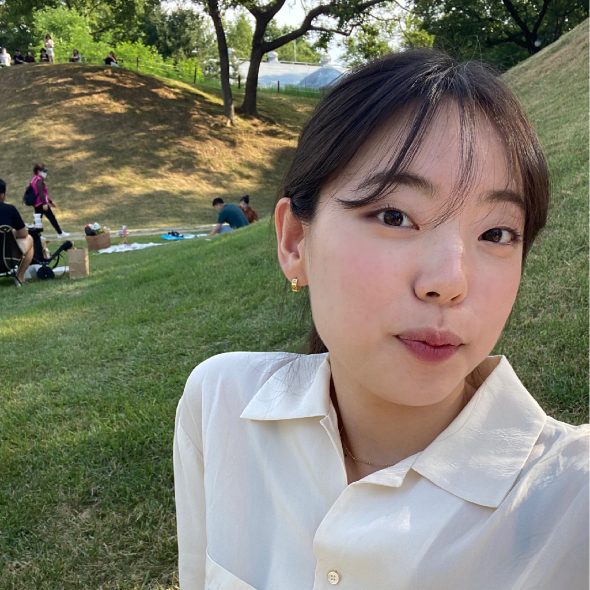
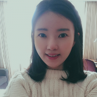
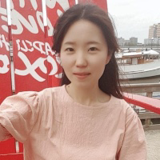
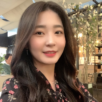

### PI: Bumhee Park, PhD

 
 * PhD in NeuroImaging (Yonsei University), MS in Statistics (HUFS)
 * Associate Professor of Biomedical Informatics (의료정보학과) in Ajou University School of Medicine  
 * Professor in charge of biostatistical consulting in Ajou University Hospital (office of biostatistics, OBS)  
 * Adjunct Professor of Ajou University League Convergence Healthcare Medicine, Institute of Science & Technology (융합의과학과)  
 * [Google scholar](https://scholar.google.com/citations?hl=ko&user=mBLSN20AAAAJ)
 * Email: [bhpark@ajou.ac.kr](bhpark@ajou.ac.kr) 
 * Office: +82-31-219-4458 
  
 * Recent Research Keywords 
   * Neuroimaging (for modeling human behaviors/mind and disease states)
   * Big Biomedical Data Science
   * Machine Learning / Biostatistics / Network Science
   * Psychiatric Common Data Model / Computational Psychiatry  
  
 * Academic Services
   * IRB committee member (for Biostatistics) at Ajou University Medical Center
   * Statistical Editor/Advisor - Journal of Neurogastroenterology and Motility, Journal of Korean Academy of Child and Adolescent Psychiatry
   * Editorial Board Member - Frontiers in Psychiatry
   * Publishing committee (on statistics) - The Korean Society of Perinatology
   * 

## ◦ Graduate Students ◦
### Yong Hyuk Cho, MD
 
* PhD student (융합형 의사과학자 과정)
* Psychiatrist (정신과학교실)
* 공동지도 with [Prof. Sang-Joon Son](https://successfulaging.github.io/)

### Seulgi Lee, MA
 
* PhD student (2nd year), MA in Clinical Psychology (Chung-Ang Univ.)

### Narae Kim, MA
 
* PhD student (1st year), MA in Cognitive Psychology (Chung-Ang Univ.)

### Dageon Yeo
 
* Ms student (join at March 2023), planning to receive BA in Psychology (Chung-Ang Univ.)
 
### Yunho Kim 
* Ms student (join at March 2023), planning to receive BS in CS (Univ. of Suwon)

### Seulki Kim 
* Ms student (join at March 2023), planning to receive BS in Life Sciences (Gyeongsang National Univ.)

## ◦ Researchers/Interns ◦

### Kyung Hee Hong, MA
 
* Adiministration

 

## ◦ Biostatistical Consulting Group (OBS) ◦
 
### Ji Hyun Park, MS
 
* Researcher, MS in Mathematics

### Jisu Kim, MS
 
* Researcher, MS in Statistics

### Sehee Jung, BS
 
* Researcher, BS in Statistics

### Alumni (Position at our lab) - current position
* Eunyoung A. Lee (PhD student / PhD researcher / Instructor)
* Heirim Lee (MA researcher) - PhD student in Duksung Women's Univ.
* Seungil Kim (BS researcher) - Researcher in Yonsei Medical School
* Seung Yun Choi (Post-MS researcher) - PhD student at SNU 
* Han-Bit Shin (OBS researcher) - PhD student at SKKU
* Ah Rim Kim (Postdoc) - Assistant Professor at Far east University
* Kyoungsuk Park (Postdoc)
* Jinhee Choung (OBS Researcher)
* Jae Eun Sin (Researcher)
* Seunghun Choi (Researcher)
* Yeo Rae Moon (OBS Researcher)
* Soo jin Kim (OBS Researcher)
